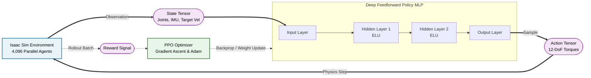

# Deep RL Locomotion for Unitree Go2 (Isaac Sim)


This repository contains the **Deep Reinforcement Learning (RL) locomotion training logic** required to drive the Unitree Go2 quadruped robot in NVIDIA Isaac Sim. 

This project isolates the core Deep Learning algorithms responsible for teaching the robot how to walk, maintain balance, and respond to velocity commands, completely independent of external navigation stacks (like ROS 2 or SLAM).

---

## 📸 Visual Demonstrations

Here is a visual progression of our Sim-to-Real deep learning pipeline:

<div align="center">
  <table style="width:100%; text-align:center;">
    <tr>
      <td><b>1. Early Training Phase</b></td>
      <td><b>2. Massively Parallel RL</b></td>
    </tr>
    <tr>
      <td><br><i>The agent struggles to maintain balance and falls frequently during the initial exploration phase.</i></td>
      <td><br><i>4,096 parallel agents trained simultaneously in Isaac Sim, drastically reducing convergence time.</i></td>
    </tr>
  </table>
  <br>
  <table style="width:100%; text-align:center;">
    <tr>
      <td><b>3. Final Result: Autonomous Navigation & SLAM</b></td>
    </tr>
    <tr>
      <td><br><i>The fully trained RL policy seamlessly integrating with ROS 2 RTAB-Map SLAM and Nav2 for autonomous obstacle avoidance.</i></td>
    </tr>
  </table>
</div>

---

## ⚠️ Prerequisites (Mandatory)

The scripts in this repository are **not standalone Python files**. They are designed to be executed inside the highly optimized Omniverse Python environment. Therefore, you **MUST** have the following software installed and configured on your system before running anything:

1. **NVIDIA Isaac Sim (5.1.0):** The core physics and rendering engine.
2. **Isaac Lab (4.1.0):** The RL wrapper framework. You must have the `isaaclab.sh` executable available in your system path or symlinked to the root of this repository.

*If you do not have Isaac Sim and Isaac Lab installed, these training scripts will not function.*

---

## 🧠 Deep Learning Foundations

### 📊 Deep RL Locomotion Architecture



The core architecture of this repository is deeply rooted in the foundational concepts of Modern Practical Deep Networks. The robot's "brain" is designed and optimized based on two critical pillars of Deep Learning:

### 1. Deep Feedforward Networks (Chapter 6)
The agent's policy (the brain, `best_agent.pt`) is structured as a **Multi-Layer Perceptron (MLP)**, a classic Deep Feedforward Network.
* **Input Layer (State):** Receives massive streams of proprioceptive data from the robot in real-time, including joint positions, joint velocities, base orientation (gravity vector), and the user's target velocity commands.
* **Hidden Layers:** Transforms these raw sensory inputs through non-linear activation functions (e.g., ELU/ReLU), extracting complex spatial and kinetic representations of the robot's state.
* **Output Layer (Action):** Outputs a continuous probability distribution mapping to target joint positions or torques for all 12 motors simultaneously.

### 2. Optimization for Training Deep Models (Chapter 8)
Training a quadruped to walk from scratch is a highly non-convex optimization problem. We utilize **PPO (Proximal Policy Optimization)** via the SKRL library to update the network weights.
* **Massive Parallelization:** We spawn **4,096 robots simultaneously** in Isaac Sim. This generates massive batch sizes, significantly reducing the variance of the gradient estimates and providing stable optimization.
* **Gradient Descent & Reward Maximization:** The Adam optimizer updates the network's weights iteratively. It strictly follows the gradients calculated via backpropagation to maximize the cumulative reward (e.g., matching target velocity, minimizing joint energy, and penalizing falls).

---

## ⚙️ How to Train the Model

### Step 1: Start the Training Process
To begin the optimization process, simply run the training script. 

```bash
./train_go2.sh
```
* **What happens under the hood:**
  1. The script calls `./isaaclab.sh` to initialize the Omniverse environment.
  2. It launches Isaac Sim in **Headless Mode** (no visual UI). This is crucial because rendering graphics wastes GPU memory. By hiding the screen, we dedicate 100% of the RTX GPU's VRAM and CUDA cores to PyTorch tensor calculations and physics simulations.
  3. It spawns 4,096 Go2 robots on a flat plane. 
  4. The SKRL library begins the PPO loop: collecting states, calculating rewards, computing the loss, and performing backpropagation to update the MLP weights.

### Step 2: Monitor the Output (Tensorboard)
While the training is running, it will continuously output logs. The most important metric to watch is the **Reward**. As the iterations increase, the reward should climb, indicating the neural network is learning to balance and walk rather than falling over.

### Step 3: Extract the Trained Weights (The Output)
Once you stop the training (or when it completes its maximum iterations), the entire neural network's knowledge is compressed and saved into a single PyTorch weight file.

* **Where is it saved?** 
  Navigate to the `logs` folder generated in your directory:
  `logs/skrl/unitree_go2_flat/<DATE_TIME>_ppo_torch/checkpoints/`
* **The Output File:** You will see files like `agent_1000.pt`, `agent_2000.pt`, and finally **`best_agent.pt`**. This `.pt` file is the literal "brain" of the robot.

---

## 🏃 How to Test the Trained Model (Inference)

To see your newly trained brain in action, you must plug the `.pt` output file into the inference script.

### 1. Update the Play Script
Open the `play.sh` file and point the `+checkpoint=` argument to the exact path of your newly generated `best_agent.pt` file.

```bash
# Example inside play.sh
./isaaclab.sh -p scripts/reinforcement_learning/skrl/play.py --task Isaac-Velocity-Flat-Unitree-Go2-v0 --num_envs 1 +checkpoint="logs/skrl/unitree_go2_flat/YOUR_NEW_FOLDER/checkpoints/best_agent.pt"
```

### 2. Run the Feedforward Network
Execute the play script to launch the visual simulation.

```bash
./play.sh
```
* **What happens under the hood:**
  1. The simulation spawns exactly **1 robot** and opens the Isaac Sim UI so you can watch it.
  2. The Python code loads your `best_agent.pt` into memory and sets `torch.inference_mode()`. This freezes the weights (no more learning).
  3. The script continuously performs forward passes (Feedforward) through the MLP. You can use your keyboard (`W, A, S, D`) to send target velocity vectors into the input layer, and watch the output layer generate perfect joint torques to make the robot walk smoothly!

---

## 📂 Deep Learning Codebase Structure

The actual PyTorch neural network logic and tensor operations are handled by the Python files within the `scripts` directory. 

* **`scripts/reinforcement_learning/skrl/train.py` (The Optimizer)**
  - This is the core training script. It initializes the **PPO Agent** (Proximal Policy Optimization).
  - It sets up the **Loss Functions** (Policy Loss, Value Loss) and the **Adam Optimizer** to calculate gradients and update the neural network weights via backpropagation over millions of iterations.

* **`scripts/reinforcement_learning/skrl/play.py` (The Feedforward Inference)**
  - This script loads the fully trained `.pt` weight file.
  - It runs the neural network in `torch.inference_mode()`. It takes the current robot sensor state as an input tensor, passes it through the Feedforward Network, and immediately applies the output tensor as torque commands to the robot's joints.

---

## 👥 Team Members
- **Minseok Lee (이민석)** - 22100504
- **Sunghwan Shim (심성환)** - 22631005