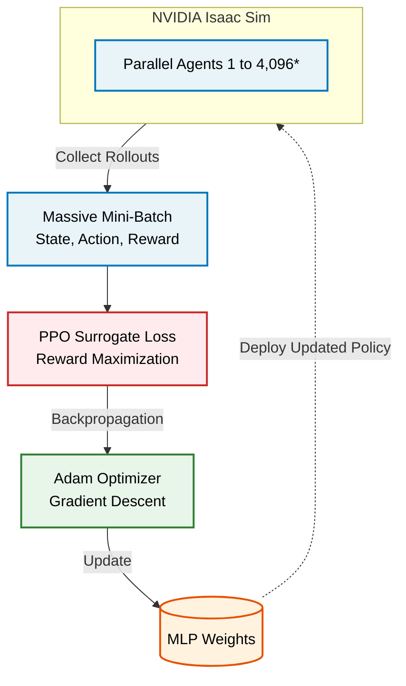

# Deep RL Locomotion for Unitree Go2 (Isaac Sim)


This repository contains the **Deep Reinforcement Learning (RL) locomotion training logic** required to drive the Unitree Go2 quadruped robot in NVIDIA Isaac Sim. 

This project isolates the core Deep Learning algorithms responsible for teaching the robot how to walk, maintain balance, and respond to velocity commands, completely independent of external navigation stacks (like ROS 2 or SLAM).

---

## 📸 Visual Demonstrations

Here is a visual progression of our Sim-to-Real deep learning pipeline:

<div align="center">
  <table style="width:100%; text-align:center;">
    <tr>
      <td><b>1. Early Training Phase<br><i>(Focus: Chapter 8)</i></b></td>
      <td><b>2. Massively Parallel RL<br><i>(Focus: Chapter 8)</i></b></td>
    </tr>
    <tr>
      <td><br><i>The agent struggles to maintain balance and falls frequently.<br>Highlights non-convex optimization and sparse reward landscapes.</i></td>
      <td><br><i>4,096 agents trained simultaneously.<br>Massive mini-batching ensures stable gradient descent.</i></td>
    </tr>
  </table>

  <br><hr style="width:70%;"><br>

  <h3>3-1. SLAM Integration</h3>
  
  <p><i>The fully trained deep learning policy seamlessly integrates with ROS 2 RTAB-Map SLAM for spatial mapping.</i></p>

  <br><hr style="width:70%;"><br>

  <h3>3-2. Final Result: Autonomous Navigation</h3>
  
  <p><i>Successful autonomous driving and obstacle avoidance utilizing the ROS 2 Nav2 stack.<br>The deep learning policy handles foundational locomotion while Nav2 directs higher-level path planning.</i></p>
</div>

---

## ⚠️ Prerequisites (Mandatory)

The scripts in this repository are **not standalone Python files**. They are designed to be executed inside the highly optimized Omniverse Python environment. Therefore, you **MUST** have the following software installed and configured on your system before running anything:

1. **NVIDIA Isaac Sim (5.1.0):** The core physics and rendering engine.
2. **Isaac Lab (4.1.0):** The RL wrapper framework. You must have the `isaaclab.sh` executable available in your system path or symlinked to the root of this repository.

*If you do not have Isaac Sim and Isaac Lab installed, these training scripts will not function.*

---

## 🧠 Deep Learning Foundations in Robotic Locomotion

While autonomous navigation (e.g., SLAM, path planning) determines *where* the robot should go, this project focuses on the foundational control problem: **how does the robot physically move its joints to walk without falling?** 

This is a highly complex, non-linear control problem that we solve entirely using Deep Learning principles, specifically drawing from **Chapter 6 (Deep Feedforward Networks)**, **Chapter 7 (Regularization)**, and **Chapter 8 (Optimization for Training Deep Models)** of standard deep learning curriculum.

### 1. Network Architecture (Chapter 6: Deep Feedforward Networks)
To control a 12-DoF (Degrees of Freedom) quadruped, traditional robotics requires complex kinematic equations. Instead, we approximate this control function using a **Multi-Layer Perceptron (MLP)**.

```mermaid
graph LR
    %% Colors and Styles
    classDef inputLayer fill:#e3f2fd,stroke:#1565c0,stroke-width:2px;
    classDef hiddenLayer fill:#fff3e0,stroke:#ef6c00,stroke-width:2px;
    classDef outputLayer fill:#e8f5e9,stroke:#2e7d32,stroke-width:2px;
    classDef tensor fill:#f3e5f5,stroke:#7b1fa2,stroke-width:1px,stroke-dasharray: 5 5;

    %% Nodes
    I_State["Input Tensor<br>(Observation State)"]:::tensor
    
    subgraph MLP [Deep Feedforward Policy Network]
        direction LR
        L1["Input Layer<br>Dim: [N]"]:::inputLayer
        H1["Hidden Layer 1<br>Dim: [512]<br>Activation: ELU"]:::hiddenLayer
        H2["Hidden Layer 2<br>Dim: [256]<br>Activation: ELU"]:::hiddenLayer
        H3["Hidden Layer 3<br>Dim: [128]<br>Activation: ELU"]:::hiddenLayer
        O1["Output Layer<br>Dim: [12]"]:::outputLayer
    end

    O_Action["Output Tensor<br>(Joint Torques)"]:::tensor

    %% Connections
    I_State -->|e.g., Gravity, Joint Vel,<br>Command Vel| L1
    L1 --> H1
    H1 --> H2
    H2 --> H3
    H3 --> O1
    O1 -->|Mapped to 12 Motors| O_Action
```



* **Input Layer (State Tensor):** The network continuously receives a high-dimensional observation vector. This is not camera data, but purely proprioceptive sensory inputs representing the robot's physical state:
  * **Gravity Vector:** To understand body orientation and tilt.
  * **Joint States:** The current position and velocity of all 12 motors.
  * **Velocity Command:** The user's desired linear/angular velocity vector (e.g., move forward at 1.0 m/s).
* **Hidden Layers (Feature Extraction):** Multiple dense layers equipped with non-linear activation functions (ELU) extract complex, spatial-temporal features from the raw sensory data. These layers build internal representations of "balance" and "momentum."
* **Output Layer (Action Tensor):** The network outputs a 12-dimensional vector. This output is directly mapped to target joint positions or torques applied to the physical motors at the next time step.

### 2. Training Strategy (Chapter 8: Optimization for Deep Models)
Training a neural network from a random initialization to walk is a severely non-convex optimization problem with an incredibly sparse reward landscape (the robot mostly falls in the beginning). We utilize advanced optimization techniques to find a robust local minimum.



* **Surrogate Objective Function (PPO Loss):** Instead of a simple Mean Squared Error, the network optimizes a Proximal Policy Optimization (PPO) loss function. It aims to maximize a cumulative **Reward Signal** (e.g., moving at the target velocity, keeping the base stable) while penalizing undesirable behaviors (e.g., excessive energy usage, falling over).
* **Adam Optimizer:** We use the Adam optimization algorithm, which adapts the learning rate for each network weight individually based on the first and second moments of the gradients. This is critical for navigating the complex loss landscape of locomotion.
* **Massive Mini-Batching for Gradient Stability:** To compute accurate gradients via Backpropagation, we must overcome the high variance of RL exploration. We achieve this by simulating **4,096 parallel environments** simultaneously in Isaac Sim. This generates massive, diverse mini-batches of state-action-reward data per iteration, drastically stabilizing the gradient updates and accelerating convergence. *(Note: 4,096 is a default configurable hyperparameter, which can be scaled up or down based on available GPU VRAM).*

---

## ⚙️ How to Train the Model

### Step 1: Start the Optimization Process
To begin training the network weights, run:

```bash
./train_go2.sh
```
* **Under the hood:** This script launches Isaac Sim in Headless Mode (saving GPU VRAM for PyTorch tensor operations) and spawns 4,096 robots. The SKRL library orchestrates the PPO loop, performing forward passes to collect data, calculating the loss, and executing backpropagation via the Adam optimizer to iteratively update the MLP weights.

### Step 2: Monitor Optimization (Tensorboard)
Monitor the training logs. The key metric is the **Reward**. As the optimizer successfully descends the loss landscape, the cumulative reward will climb, indicating the MLP is learning structural representations of walking.

### Step 3: Checkpointing and The Optimal Policy (`best_agent.pt` / Chapter 7)
Deep RL training is an iterative process that typically runs for thousands of iterations (e.g., 5,000 to 10,000). 
* **Periodic Checkpoints:** As the optimization progresses, the system saves the network's weights at regular intervals (e.g., `agent_1000.pt`, `agent_2000.pt`). These serve as historical snapshots of the learning process.
* **Regularization via Early Stopping (Chapter 7):** RL training is highly prone to instability—a model might walk perfectly at iteration 3,000 but "forget" how to walk by iteration 4,000 due to over-exploration or bad gradient updates (a form of overfitting to recent batches). To solve this, we apply a concept from **Chapter 7 (Regularization for Deep Learning)**: **Early Stopping**. The SKRL library continuously evaluates the agent and tracks the average episodic reward. The specific set of weights that achieved the **highest historical reward** is automatically isolated and saved as `best_agent.pt`. This acts as a regularization technique, ensuring we always extract the absolute optimal, most generalized policy, regardless of any future training degradation.

---

## 🏃 How to Test the Trained Model (Inference)

To evaluate the trained network in a live physics simulation:

### 1. Update the Play Script
Point the `+checkpoint=` argument in `play.sh` to your newly trained weight file.

### 2. Run the Feedforward Pass
```bash
./play.sh
```
* **Under the hood:** The script loads the `.pt` file and sets `torch.inference_mode()`, freezing the network weights. As the simulation runs, the script continuously performs **Feedforward passes** through the MLP, transforming the current state tensor into instantaneous motor torque commands in real-time.

---

## 📂 Deep Learning Codebase Structure

The mapping of Deep Learning concepts to our PyTorch codebase:

* **`scripts/reinforcement_learning/skrl/train.py` (The Optimizer)**
  - Implements the optimization logic (Chapter 8).
  - Initializes the neural network, defines the PPO loss function, and configures the Adam optimizer.
  - Manages the collection of the massive 4,096-agent batch data required for stable backpropagation.

* **`scripts/reinforcement_learning/skrl/play.py` (The Feedforward Inference)**
  - Implements the execution phase (Chapter 6).
  - Handles the real-time mapping of Isaac Sim sensor data into the Input Tensor, passes it through the MLP, and applies the Output Tensor back to the physics engine.

---

## 🚀 What's Next? (Sim-to-Real)

While our current model successfully navigates the simulated environment, the ultimate goal of Deep RL in robotics is **Sim-to-Real transfer**. 

<div align="center">
  <br>
  <i>The real Unitree Go2 robot performing a physical action. The next phase involves deploying our trained MLP brain directly into this physical hardware.</i>
</div>

Future iterations will focus on minimizing the "reality gap" by introducing Domain Randomization (varying mass, friction, and motor latency during training) so the `best_agent.pt` can seamlessly control the physical Unitree Go2 robot in the real world!

---

## 👥 Team Members
- **[Minseok Lee (이민석)](https://github.com/Glen02lee)** - 22100504
- **[Sunghwan Shim (심성환)](https://github.com/hwan129)** - 22631005