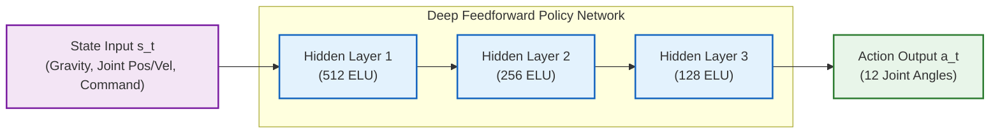
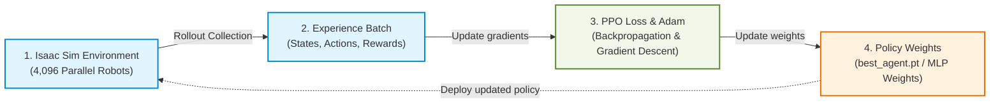
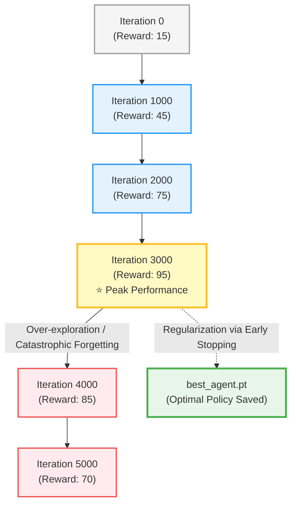
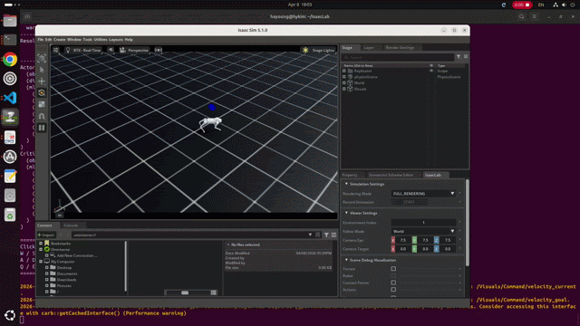
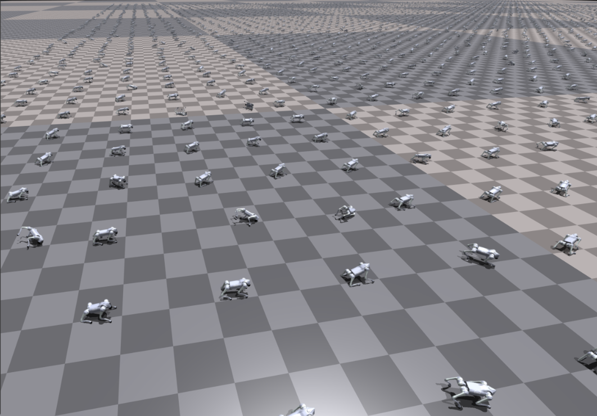
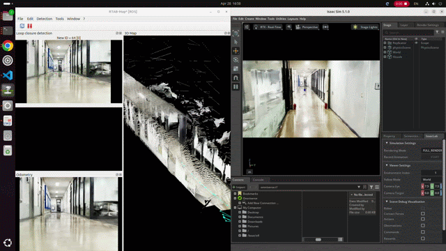

# Deep RL Locomotion for Unitree Go2 (Isaac Sim)


---

## 👥 Team Members
- **Minseok Lee (이민석)** - 22100504 ([GitHub](https://github.com/Glen02lee))
- **Sunghwan Shim (심성환)** - 22631005 ([GitHub](https://github.com/hwan129))
- **Hyunmo Kang (강현모)** - 22100026 ([GitHub](https://github.com/hmkang012))

---

## 🎥 Project Presentation Video (YouTube)

<div align="center">
  <a href="https://youtu.be/mHaLuUE3lUo">
    
  </a>
  <br><br>
  <p><i>Click the image above or use the link below to watch the full 7-minute presentation on YouTube:</i></p>
  <p><b>🔗 Video Link: <a href="https://youtu.be/mHaLuUE3lUo">https://youtu.be/mHaLuUE3lUo</a></b></p>
  <p><b>📄 Presentation Slides: <a href="./docs/Isaac%20Go2%20RL%20Training.pdf">Isaac Go2 RL Training.pdf</a></b> / <b><a href="file:///C:/Users/USER/Desktop/캡스톤/go2/isaac-go2-rl-training/docs/Isaac%20Go2%20RL%20Training.pdf">Local Path</a></b></p>
</div>

---

## 📌 Table of Contents
1. [Introduction](#1-introduction)
2. [Task and Method](#2-task-and-method)
   - [A. State and Action Space](#a-state-and-action-space)
   - [B. Network Architecture (Chapter 6)](#b-network-architecture-chapter-6-deep-feedforward-networks)
   - [C. Optimization Strategy (Chapter 8)](#c-optimization-strategy-chapter-8-optimization-for-deep-models)
3. [Experiments & Implementation](#3-experiments--implementation)
   - [A. Prerequisites](#a-prerequisites-mandatory)
   - [B. Training the Model](#b-training-the-model)
   - [C. Inference (Testing)](#c-inference-testing)
   - [D. Codebase Mapping](#d-codebase-mapping)
4. [Results & Analysis](#4-results--analysis)
   - [A. Optimization and Regularization (Chapter 7)](#a-optimization-and-regularization-chapter-7-regularization)
   - [B. Visual Demonstrations](#b-visual-demonstrations)
5. [Conclusion & Future Work](#5-conclusion--future-work)
6. [References](#6-references)

---

## 1. Introduction

Controlling a quadrupedal robot involves coordinating a high-dimensional joint space (12 Degrees of Freedom) based on continuous multi-sensor feedback (IMUs, joint encoders, and contact sensors). Using traditional model-based control methods to mathematically model and integrate all these sensor dynamics is extremely complex and time-consuming, especially when dealing with unpredictable or rough terrains.

Furthermore, quadrupedal robots are highly sophisticated, expensive hardware. Directly testing unverified control algorithms or raw policies on physical robots in the real world is incredibly risky. Falls, collisions, and motor overloads can easily result in catastrophic hardware damage, significant financial loss, and safety hazards. 

To resolve these challenges, this project applies **Deep Reinforcement Learning (DRL)** in a high-fidelity physics simulator (**NVIDIA Isaac Sim** using the **Isaac Lab** framework). This approach allows the robot to learn optimal locomotion "reflexes" through massive, safe trial-and-error simulation, completely eliminating any risk to physical hardware. By training a deep neural network policy to map sensory feedback directly to motor commands, we establish a safe, stable, and cost-effective pipeline that bridges the gap between simulation and real-world deployment (Sim-to-Real).

---

## 2. Task and Method

We formulate the locomotion problem as a Reinforcement Learning task under a Markov Decision Process (MDP). The agent interacts with the Isaac Sim physics environment to learn an optimal policy $\pi_\theta(a|s)$ parameterized by the weights $\theta$ of a deep neural network.

### A. State and Action Space

To formalize the locomotion task, we map the robot's physical variables to RL state and action spaces:

| Space &nbsp;&nbsp;&nbsp;&nbsp;&nbsp;&nbsp;&nbsp;&nbsp;&nbsp;&nbsp;&nbsp;&nbsp;&nbsp;&nbsp;&nbsp;&nbsp;&nbsp;&nbsp;&nbsp;&nbsp;&nbsp;&nbsp;&nbsp;&nbsp; | Dimension / Components &nbsp;&nbsp;&nbsp;&nbsp;&nbsp;&nbsp;&nbsp;&nbsp;&nbsp;&nbsp;&nbsp;&nbsp;&nbsp;&nbsp;&nbsp;&nbsp; | Description |
| :--- | :--- | :--- |
| **State Space ($s_t$)** | **Proprioceptive observations** | Projected gravity vector (body tilt), joint positions & velocities (12 DoF), and linear/angular velocity commands ($v_x, v_y, \omega_z$). |
| **Action Space ($a_t$)** | **12 Dimensions** | Target joint positions for the 12 actuators, processed via Proportional-Derivative (PD) controllers to apply motor torques. |
| **Reward Function ($r_t$)** | **Multi-objective sum** | Reward for velocity tracking ($r_{vel}$), base stability ($r_{stable}$), and penalties for falling ($p_{fall}$) and high energy torque changes ($p_{torque}$). |

---

### B. Network Architecture (Chapter 6: Deep Feedforward Networks)

To approximate the control function, we design a Multi-Layer Perceptron (MLP) that processes state inputs and outputs motor commands in real-time.



* **Hidden Layers:** Three dense layers with **ELU (Exponential Linear Unit)** activations are utilized to handle negative inputs and avoid the vanishing gradient problem, allowing the network to capture complex, non-linear relationships.

---

### C. Optimization Strategy (Chapter 8: Optimization for Deep Models)

Training the policy network starting from a random initialization is a severely non-convex optimization problem with a sparse reward landscape. To achieve convergence and stability, we utilize:
* **Proximal Policy Optimization (PPO) Loss:** A surrogate objective function that clips probability updates, ensuring the policy does not deviate too far from the previous iteration, preventing catastrophic performance drops.
* **Adam Optimizer:** An adaptive learning rate optimization algorithm that computes individual learning rates for each weight based on running estimates of the first and second moments of the gradients.
* **Massively Parallel Rollouts:** We leverage GPU-accelerated simulation to spawn **4,096 parallel agents** in Isaac Sim. This generates extremely large and diverse mini-batches of experiences, significantly reducing gradient variance and accelerating backpropagation convergence.



---

## 3. Experiments & Implementation

### A. Prerequisites (Mandatory)
The simulation requires the following software ecosystem:
* 🛠️ **NVIDIA Isaac Sim (5.1.0):** The core physics and photorealistic rendering engine.
* 📦 **Isaac Lab (2.3.0):** The robot learning wrapper framework. Ensure `isaaclab.sh` is configured in your system path.

---

### B. Training the Model
1. **Launch the Training Script:**
   ```bash
   ./train_go2.sh
   ```
2. **Mechanism:** The script starts Isaac Sim in headless mode. The **SKRL** library coordinates the training loop, feeding state inputs to the MLP, computing the PPO loss, and updating weights using the Adam optimizer across **4,096 parallel environments** on the GPU.

---

### C. Inference (Testing)
1. **Run the Inference Script:**
   ```bash
   ./play.sh
   ```
2. **Mechanism:** The model weights are frozen using `torch.inference_mode()`. Feedforward passes map sensory inputs directly to motor targets at 50 Hz.

---

### D. Codebase Mapping

We map the core deep learning concepts directly to our PyTorch implementation:

* 🖥️ **[train.py](file:///C:/Users/USER/Desktop/캡스톤/go2/isaac-go2-rl-training/scripts/reinforcement_learning/skrl/train.py) (The Optimization Loop):**
  Sets up PPO loss hyperparameters, configures the Adam optimizer, and orchestrates the massive 4,096-agent rollout collection for gradient backpropagation.
* 🎮 **[play.py](file:///C:/Users/USER/Desktop/캡스톤/go2/isaac-go2-rl-training/scripts/reinforcement_learning/skrl/play.py) (The Inference Engine):**
  Loads `best_agent.pt`, configures the inference environment, and executes feedforward passes to output motor commands in real-time.

---

## 4. Results & Analysis

### A. Optimization and Regularization (Chapter 7 & 8)

Deep RL is highly prone to instability; policies may overfit to recent exploration paths and "forget" how to walk (catastrophic forgetting). This section directly connects **Chapter 8 (Optimization)**—the iterative process of descending the loss landscape to maximize reward—with **Chapter 7 (Regularization)**—preserving the best model before optimization degrades.



The system continuously tracks episodic performance and automatically saves the checkpoint that achieved the **highest historical reward** as `best_agent.pt`. This acts as a regularization mechanism, extracting the most generalized model before performance degrades.

---

### B. Visual Demonstrations

<div align="center">
  <table style="width:100%; text-align:center;">
    <tr>
      <td><b>1. Early Training Phase<br><i>(Struggles to balance)</i></b></td>
      <td><b>2. Massively Parallel RL<br><i>(Gradient Stability)</i></b></td>
    </tr>
    <tr>
      <td><br><i>The agent struggles to maintain balance.</i></td>
      <td><br><i>4,096 agents trained simultaneously.</i></td>
    </tr>
  </table>

  <br><hr style="width:70%;"><br>

  <h3>3. SLAM Integration & Autonomous Navigation</h3>
  <table style="width:100%; text-align:center;">
    <tr>
      <td><b>3-1. ROS 2 RTAB-Map SLAM</b></td>
      <td><b>3-2. Autonomous Navigation (Nav2)</b></td>
    </tr>
    <tr>
      <td><br><i>Mapping the environment in real-time.</i></td>
      <td><br><i>Path planning combined with Deep RL locomotion.</i></td>
    </tr>
  </table>
</div>

---

## 5. Conclusion & Future Work

By utilizing a three-layer deep feedforward network trained via Proximal Policy Optimization (PPO), we successfully enabled the Unitree Go2 robot to learn stable locomotion behaviors. Deploying massive parallel rollouts in Isaac Sim minimized gradient variance, enabling quick optimization of a non-convex loss function. 

<div align="center">
  <br>
  <i>The real Unitree Go2 robot performing a physical action.</i>
</div>

**Future Work (Sim-to-Real):**
Our next milestone is deploying `best_agent.pt` directly onto physical hardware. To address the "reality gap" (differences in friction, motor latencies, and mass distributions), we will implement **Domain Randomization** during training, adding Gaussian noise to physical properties to ensure the learned weights are highly robust in the real world!

---

## 6. References

1. Goodfellow, I., Bengio, Y., & Courville, A. (2016). *Deep Learning*. MIT Press. (Chapter 6: Feedforward Networks, Chapter 7: Regularization, Chapter 8: Optimization).
2. Schulman, J., Wolski, F., Dhariwal, P., Radford, A., & Klimov, O. (2017). Proximal policy optimization algorithms. *arXiv preprint arXiv:1707.06347*. [PPO Paper](https://arxiv.org/abs/1707.06347)
3. Liang, J., Makoviychuk, V., Handa, A., Chentanez, N., Macklin, M., & Fox, D. (2018). GPU-accelerated robotic simulation for distributed reinforcement learning. *arXiv preprint arXiv:1810.05762*. [Isaac Gym Paper](https://arxiv.org/abs/1810.05762)
4. CLeARoboticsLab. *go2_isaac_ros2*: Unitree Go2 Sim-to-Real controller repository. [GitHub Repository](https://github.com/CLeARoboticsLab/go2_isaac_ros2.git)
5. abizovnuralem. *go2_omniverse*: Unitree Go2 robot in NVIDIA Isaac Omniverse environment. [GitHub Repository](https://github.com/abizovnuralem/go2_omniverse.git)
